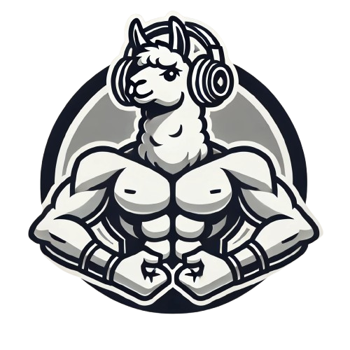
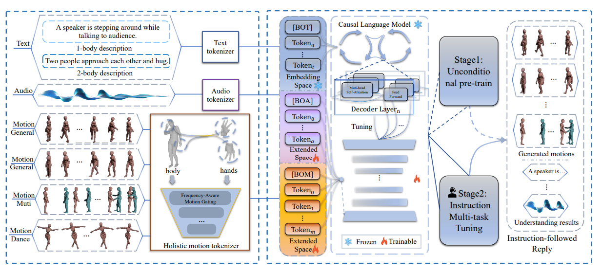

#  **MotionLLaMA: A Unified Framework for Motion Synthesis and Comprehension**



<p align="center">
  <a href='https://arxiv.org/abs/2411.17335'>
    
  </a>
  <a href='https://zeyuling.github.io/MotionLLaMA/'>
  </a>
  <!-- <a href='https://youtu.be/0a0ZYJgzdWE'>
  </a> -->
  <a href='https://github.com/ZeyuLing/MotionLLaMA'>
    </a>
</p>

<p align="center">
<strong>MotionLLaMA: A Unified Framework for Motion Synthesis and Comprehension</strong>
    <br>
    <a href='https://scholar.google.be/citations?hl=nl&user=znEflnQAAAAJ&view_op=list_works&gmla=AOAOcb2TR7qEXM6UaMoS2X58UZTBNRqgsZuX5pVg44IH3QjDY34EcXsYR1ulftMWcE4I2NDA6-JqCvBmLANJgCfgDvkD' target='_blank'>Zeyu Ling*</a>&emsp;
    <a href='' target='_blank'>Bo Han*</a>&emsp;
    <a href='' target='_blank'>Shiyang Li</a>&emsp;
    <a href='' target='_blank'>Hongdeng Shen</a>&emsp;
    <a href='' target='_blank'>Jikang Cheng</a>&emsp;
    <a href='' target='_blank'>Changqing Zou</a>&emsp;
    <br>
    Zhejiang University&emsp;
    Zhejiang Lab
    <br>
</br>


## 💻 Project Page


<p align="center">

  <a href='https://zeyuling.github.io/MotionLLaMA/'></a>

  		</a>

</p>

## 📖 Introduction

This project introduces:

- MMotion: A public motion-related common library based on MMEngine, which includes PyTorch implementations of
  MotionLLaMA and various motion models.

- MotionHub: Currently the largest open-source multimodal, multi-task motions dataset.

## 📜 TODO List

- [x] Release the MMotion Library.
- [x] Release the MotionHub dataset.
- [x] Release the demo video.
- [ ] Release MotionLLaMA official implementation.


## 📥 Dataset Download

<div align="center">
<table cellspacing="0" cellpadding="0" bgcolor="#ffffff" border="0">
  <tr>
    <th align="center">Dataset</th>
    <th align="center">Clip Number</th>
    <th align="center">Caption Number</th>
    <th align="center">Google Drive</th>
    <th align="center">Baidu Disk</th>
  </tr>
  <tr></tr>
  <tr>
  <td align="center"><b>MotionHub V1</b></td>
  <td align="center"><b>131512</b></td>
  <td align="center"><b>269873</b></td>
  <td align="center"><b></b></td>
  <td align="center"><b>https://pan.baidu.com/s/1ozx1LEU88Zoyq80tvT7Bfw?pwd=AIXM</b></td>
  </tr>
</table>
</div>


[//]: # (## ⚙️ Implementation)

[//]: # ()

[//]: # (Coming soon!)

[//]: # (## 🤝 Citation)

[//]: # ()

[//]: # (If you find this repository useful for your work, please consider citing it as follows:)

[//]: # ()

[//]: # (```)

[//]: # (@article{ling2023mcm,)

[//]: # (  title={Mcm: Multi-condition motion synthesis framework for multi-scenario},)

[//]: # (  author={Ling, Zeyu and Han, Bo and Wong, Yongkang and Kangkanhalli, Mohan and Geng, Weidong},)

[//]: # (  journal={arXiv preprint arXiv:2309.03031},)

[//]: # (  year={2023})

[//]: # (})

[//]: # (```)
